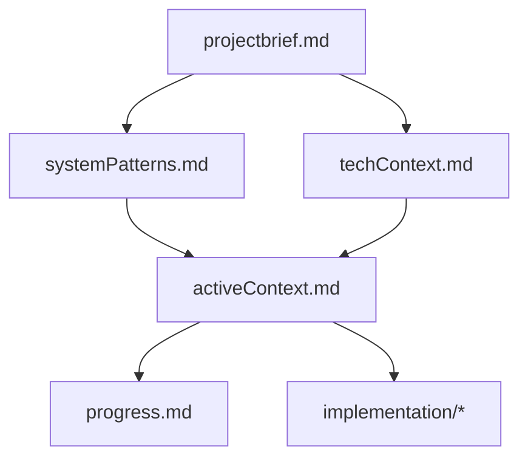

# Memory Registry

## Core Documents
- projectbrief.md - Project overview and requirements
- systemPatterns.md - System architecture and design patterns
- techContext.md - Technical stack and development environment
- activeContext.md - Current development focus and decisions
- progress.md - Implementation progress tracking

## Implementation Plans
- implementation/
  - 01_core_infrastructure.md - Base system setup and infrastructure
  - 02_ollama_integration.md - LLM server integration and queue system
  - 03_authentication.md - User authentication and access control
  - 04_api_gateway.md - API routing and request handling
  - 05_web_interface.md - Chat interface implementation
  - 06_admin_panel.md - Administration interface
  - 07_monitoring.md - System monitoring and logging

## Document Dependencies

## Recent Updates
- Initial creation of memory registry
- Project brief established
- Implementation plans pending creation